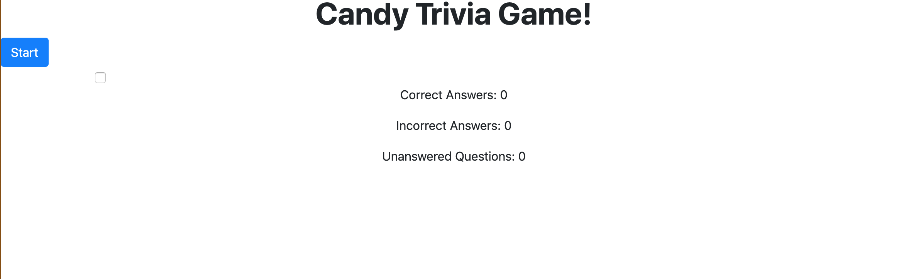

# TriviaGame
This project was done on the fifth week on Vanderbilt's Coding Bootcamp. 

## Screen Shot 
Before user hits the start button:

Once the user hits the start button:

Once the timer runs out:

## Technologies Used
- jQuery 
- Bootstrap

### Future Goals
- Create checkboxes for the trivia answers
- Style 

